# Smush

_Smush_ together commands and run them in parallel.
If any of it fails, Smush will wait for all of the commands to finish, then report non-zero exit code.

## Usage

Smush configuration can be written in YAML.

```yaml
commands:
  - name: ruff
    runs: poetry run ruff
  - name: prettier
    runs: npx prettier --check .
```

And then tell Smush where to find that file:

```sh
smush -c path-to-config.yaml
```

## Why?

GitHub Actions is a powerful tool that makes continuous integration (CI) setup easy for many projects.
Projects often have several linters to run in CI and they are significantly faster than, say, running tests.
Typically, this ends up with either of the following scenario.

1. Consolidate the linters into a single job that run sequentially. The downside here is if the first one fails, you won't know if the rest passes or not until you fix that first one.
1. Run in separate jobs, such that if you have _N_ linters, you will have to duplicate setup (e.g. installing compiler and dependencies) by _N_ times. Not only tt's wasteful, but it also eats up GitHub Action credits.[^1]

Option 2 is the good stuff, but the cost adds up quickly as the number of contributor grows.

```mermaid
gantt
    title Parallel without Smush (3 minute credit per run)
    dateFormat  HH:mm:ss
    axisFormat  %M:%S
    section Linter 1
    Installing compiler     :a, 00:00:00, 20s
    Installing dependencies :b, after a , 10s
    Linter 1 ¯\_(ツ)_/¯      :after b, 1s
    section Linter 2
    Installing compiler     :a, 00:00:00, 20s
    Installing dependencies :b, after a , 10s
    Linter 2 ¯\_(ツ)_/¯     :after b, 2s
    section Linter 3
    Installing compiler     :a, 00:00:00, 20s
    Installing dependencies :b, after a , 10s
    Linter 3 ¯\_(ツ)_/¯     :after b, 3s
```



With Smush, you can _smush_ (promise it's the last time) both approaches together by creating one job for all linters and delegate parallelism to Smush.

```mermaid
gantt
    title Parallel on 2-core machine with Smush (1 minute credit)
    dateFormat  HH:mm:ss
    axisFormat  %M:%S
    section Linters
    Installing compiler     :a, 00:00:00, 20s
    Installing dependencies :b, after a , 10s
    Linter 1                :c, after b, 1s
    Linter 2                :after b, 2s
    Linter 1                :after c, 3s
```



A longer story of how this project came to be was [posted on Wilson's site](https://www.husin.dev/smush-parallel-command-runner/).

[^1]: [GitHub Actions rounds credit consumption to the nearest whole minute](https://docs.github.com/en/billing/managing-billing-for-github-actions/about-billing-for-github-actions#:~:text=GitHub%20rounds%20the%20minutes%20and%20partial%20minutes%20each%20job%20uses%20up%20to%20the%20nearest%20whole%20minute.).
